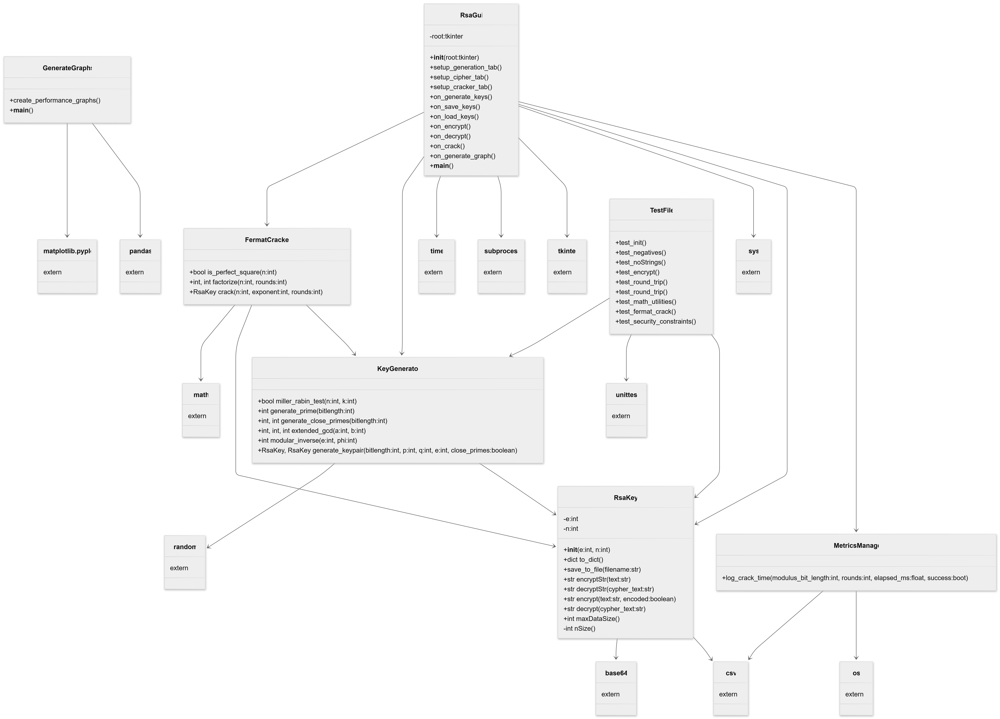

# RSA Key Cracking Suite 

* Author: Bridger Bergeson, Calvin Arnold, Logan Byrum, Simeon Grant, Zachary Peterson
* Class: Sp26 - CS 331 001 Computer Security, Boise State University
* Instructor: Sindhu Reddy Kalathur Gopal

## Overview

A Python GUI application for generating RSA key pairs, encrypting and decrypting text using RSA keys, and cracking private RSA keys using Fermat Factorization.

## Building the project

This project was built for **Python 3.14** and uses **Makefiles** to install dependencies and start the program.

Dependencies can be install using: 

`make install`

*Note:* [requirement.txt](./requirements.txt) list project dependencies.

After installing dependencies, run the project using:

`make`

Generated files can be deleted using:

`make clean`

Installed dependencies can be uninstalled using:

`make uninstall`

## UML

## Sources used

[1] kartik, “Python program for extended euclidean algorithms,” GeeksforGeeks, 29-May-2015. [Online]. Available: https://www.geeksforgeeks.org/python/python-program-for-basic-and-extended-euclidean-algorithms-2/. [Accessed: 01-May-2026].

[2] kartik, “Modular multiplicative inverse,” GeeksforGeeks, 20-June-2015. [Online]. Available: https://www.geeksforgeeks.org/dsa/multiplicative-inverse-under-modulo-m/. [Accessed: 01-May-2026].

[3] Wikipedia contributors, “Miller–Rabin primality test,” Wikipedia, The Free Encyclopedia, 20-Apr-2026. [Online]. Available: https://en.wikipedia.org/w/index.php?title=Miller%E2%80%93Rabin_primality_test&oldid=1350231802. [Accessed: 01-May-2026].

[4] Wikipedia contributors, “Pierre de Fermat,” Wikipedia, The Free Encyclopedia, 13-Apr-2026. [Online]. Available: https://en.wikipedia.org/w/index.php?title=Pierre_de_Fermat&oldid=1348565512. [Accessed: 01-May-2026].

[5] Wikipedia contributors, “Base64,” Wikipedia, The Free Encyclopedia, 06-Mar-2026. [Online]. Available: https://en.wikipedia.org/w/index.php?title=Base64&oldid=1342090898. [Accessed: 01-May-2026].
